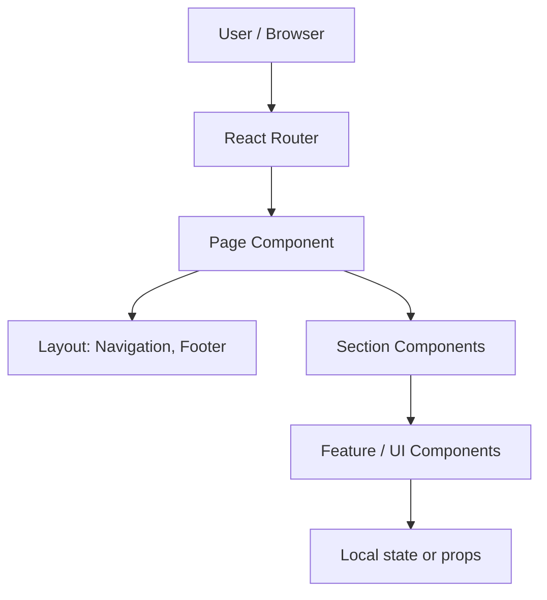

# Architecture — Na Kawkę

> **Last updated:** 2025-02-24  
> **Version:** 1.0.0

---

## 📌 Project Overview

**Na Kawkę** — лендинг об автономном кофейном бизнесе. Целевая аудитория: потенциальные партнёры и клиенты. Задача: презентация продукта, пакетов (Standard/Premium), калькулятора ROI и призыв к действию.

---

## 🛠 Tech Stack

| Layer       | Technology   | Version |
|------------|--------------|---------|
| Build      | Vite         | 6.x     |
| Framework  | React        | 18.x    |
| Routing    | React Router | 7.x     |
| Language   | TypeScript   | 5.x     |
| Styling    | Tailwind CSS | 4.x     |
| Animation  | Motion       | 12.x    |
| UI primitives | Radix UI  | —       |
| Deployment | Static (Coolify / Netlify) | — |

---

## 📁 Directory Structure

```
src/
├── app/                           # Application shell: routing, pages, components
│   ├── components/
│   │   ├── ui/                    # Primitives: Button, Card, MetallicButton, GlassCard, Radix-based
│   │   ├── layout/                # Navigation, Footer, PageWrapper
│   │   ├── sections/              # Page sections: Hero, WhatIsNaKawke, Pricing, ROICalculator…
│   │   ├── features/              # Feature components: PricingCard, ProfitCalculator
│   │   └── figma/                 # Figma-related (e.g. ImageWithFallback)
│   ├── pages/                     # Route-level pages: Home, PackageStandard, PackagePremium
│   ├── shared/
│   │   └── constants/             # navigation.ts (SECTION_IDS, NAV_LINKS)
│   ├── App.tsx
│   └── routes.ts                  # React Router config
│
├── styles/                        # globals: index.css, tailwind.css, theme.css, fonts.css
├── assets/                        # Images, static assets (logo, package images)
├── main.tsx                       # Entry: createRoot, RouterProvider
└── vite-env.d.ts
```

---

## 🧩 Layer Responsibilities

| Layer                    | Responsibility                          | May import from        |
|--------------------------|-----------------------------------------|------------------------|
| `app/`                   | Routing, page composition               | components, constants  |
| `app/pages/`             | Page composition, layout (Nav + Footer)| layout, sections, ui   |
| `app/components/ui/`     | Stateless primitives                    | utils, types, styles   |
| `app/components/layout/` | Header, Footer, navigation              | ui, constants          |
| `app/components/sections/` | Full-width page sections              | ui, features           |
| `app/components/features/` | Reusable feature blocks               | ui, figma              |
| `app/shared/constants/`  | App-wide constants                      | —                      |
| `styles/`                | Global CSS, design tokens               | —                      |

---

## 🔄 Data Flow



SPA: нет бэкенда в текущей версии; данные статичны или в константах.

---

## 📱 Mobile & Responsive Strategy

- **Approach:** Mobile-first. Компоненты рассчитаны от 320px вверх.
- **Breakpoints:** `sm 640px` / `md 768px` / `lg 1024px` / `xl 1280px` (Tailwind).
- **Typography:** По возможности fluid с `clamp()` для заголовков.
- **Layout:** CSS Grid для страницы, Flexbox для блоков.
- **Images:** Responsive, `max-width: 100%`; при использовании Next.js `<Image>` — с `sizes`.
- **Touch:** Интерактивные элементы не менее 44×44px.

---

## 🌍 Environment Variables

На текущем этапе приложение статическое; переменные окружения не обязательны. При появлении API или аналитики — описать здесь (например `VITE_API_URL`).

---

## 🔗 External Integrations

| Service / источник | Назначение                    |
|--------------------|-------------------------------|
| Figma (опционально) | Импорт ассетов `figma:asset/` (Vite plugin подменяет плейсхолдером) |

---

## 🧱 Key Architectural Decisions (ADRs)

### ADR-001: Vite вместо CRA
**Решение:** Сборка на Vite.  
**Причина:** Быстрый HMR, современный ESM, простой конфиг.  
**Компромисс:** Эволюция экосистемы CRA не используется.

### ADR-002: React Router для SPA
**Решение:** React Router 7, createBrowserRouter.  
**Причина:** Декларативные маршруты, ленивая загрузка при необходимости.  
**Компромисс:** Для статического хостинга нужен SPA fallback (`try_files … /index.html` или `_redirects`).

### ADR-003: Компоненты внутри `app/`
**Решение:** `app/components/` (ui, layout, sections, features), а не `src/components/` на верхнем уровне.  
**Причина:** Лендинг в одном месте; при росте можно вынести в `src/components/` и обновить импорты.

---

## 📝 Changelog

| Date       | Change                                      |
|------------|---------------------------------------------|
| 2025-02-24 | Архитектура приведена к реальному стеку (Vite, React, React Router) и структуре проекта. |

---

> ⚠️ При изменении структуры, добавлении API, интеграций или новых паттернов — обновлять этот файл в первую очередь.
