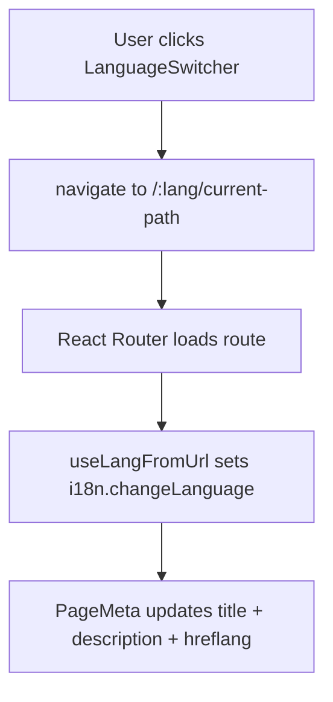
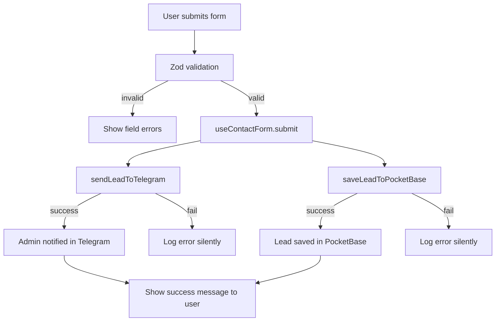

# Architecture — Na Kawkę

> **Last updated:** 2025-03-01  
> **Version:** 3.0.0

---

## 📌 Project Overview

**Na Kawkę** — landing page for an autonomous coffee business. Target audience: potential partners and clients. Purpose: product presentation, packages (Standard/Premium), ROI calculator, contact form (leads sent to Telegram + stored in PocketBase), and call-to-action.

**Languages:** Polish (primary, default), English, Ukrainian.

---

## 🛠 Tech Stack

| Layer                    | Technology                                                          | Version |
|--------------------------|---------------------------------------------------------------------|---------|
| Build                    | Vite                                                                | 6.x     |
| Framework                | React                                                               | 18.x    |
| Routing                  | React Router                                                        | 7.x     |
| Language                 | TypeScript                                                          | 5.x     |
| Styling                  | Tailwind CSS                                                        | 4.x     |
| Animation                | Motion                                                              | 12.x    |
| UI primitives            | Radix UI                                                            | —       |
| SEO / Head mgmt          | react-helmet-async                                                  | —       |
| Form validation          | Zod                                                                 | —       |
| i18n                     | i18next + react-i18next (language from URL)                          | —       |
| Backend-as-a-service     | PocketBase SDK                                                      | —       |
| Notifications            | Telegram Bot API                                                    | —       |
| Deployment               | Static (Coolify / Netlify); optional pre-built Docker image (CI/CD)  | —       |

---

## 📁 Directory Structure

```
src/
├── app/
│   ├── components/
│   │   ├── ui/                   # Primitives: Button, Card, Input, LanguageSwitcher…
│   │   ├── layout/               # Navigation, Footer, PageWrapper
│   │   ├── sections/             # Hero, WhatIsNaKawke, BusinessPains, Autonomy, FranchiseComparison…
│   │   ├── features/             # PricingCard, ProfitCalculator…
│   │   ├── seo/                  # PageMeta (title, description, canonical, OG, hreflang), StructuredData
│   │   └── figma/                # ImageWithFallback
│   ├── pages/                    # Home, PackageStandard, PackagePremium
│   ├── shared/
│   │   └── constants/            # navigation.ts, seo.ts, packages.ts
│   ├── App.tsx
│   └── routes.tsx
│
├── hooks/                        # useContactForm, useRoiCalc, useScrollSpy…
├── services/                     # telegram.ts, leads.ts, content.ts
├── lib/                          # pocketbase.ts, i18n.ts
├── locales/
│   ├── pl/translation.json       # Polish — primary, source of truth
│   ├── en/translation.json       # English
│   └── uk/translation.json       # Ukrainian
├── types/                        # Lead, Package, ApiResponse…
├── styles/                       # index.css, tailwind.css, theme.css, fonts.css
├── assets/
│   ├── images/                   # WebP / AVIF source images
│   └── fonts/                    # Optional: extra self-hosted fonts; Inter via @fontsource-variable/inter
└── main.tsx
```

---

## 🧩 Layer Responsibilities

| Layer                      | Responsibility                                         | May import from              |
|----------------------------|--------------------------------------------------------|------------------------------|
| `app/pages/`               | Page composition + SEO meta (Home, PackageStandard, PackagePremium, Privacy) | layout, sections, seo, ui    |
| `app/components/ui/`       | Stateless primitives incl. LanguageSwitcher            | types, styles                |
| `app/components/layout/`   | Header, Footer, navigation + language switcher         | ui, constants                |
| `app/components/sections/` | Full-width page sections                               | ui, features                 |
| `app/components/features/` | Reusable feature blocks                                | ui, figma                    |
| `app/components/seo/`      | PageMeta (canonical, OG, hreflang), StructuredData   | react-helmet-async           |
| `hooks/`                   | Stateful logic (form, calc, scroll)                    | services, types              |
| `services/`                | External API calls (Telegram, PocketBase)              | lib, types                   |
| `services/content.ts`      | PocketBase `content` collection translations           | lib/pocketbase, lib/i18n     |
| `lib/`                     | Third-party SDK instances (PocketBase, i18n)           | —                            |
| `locales/`                 | Translation JSON files. Polish is the source of truth  | —                            |
| `app/shared/constants/`    | App-wide constants                                     | —                            |
| `styles/`                  | Global CSS, design tokens                              | —                            |

---

## 🔄 Data Flow

### Page Rendering
```mermaid
graph TD
    A[Browser] --> I[i18n init + static JSON]
    I --> C1[Load PocketBase content translations]
    C1 -->|success| C2[Cache in sessionStorage (5min TTL)]
    C1 -->|fail| B[React Router] 
    C2 --> B[React Router]
    B --> C[Page Component]
    C --> D[PageMeta / StructuredData]
    C --> E[Layout: Navigation + Footer]
    C --> F[Section Components]
    F --> G[Feature / UI Components]
    G --> H[Local state or props + i18next t()]
```

### Translations Loading
```mermaid
graph TD
    A[App start] --> B[initI18n()]
    B --> C[i18next loads static JSON from /locales]
    C --> D[loadRemoteTranslations()]
    D --> E[Check sessionStorage cache (5 min TTL)]
    E -->|cache hit| F[i18n.addResourceBundle override with cached PocketBase values]
    E -->|cache miss| G[Fetch PocketBase content collection]
    G --> H[Normalize to {pl, en, uk} maps]
    H --> I[i18n.addResourceBundle override with PocketBase values]
    G -->|PocketBase unavailable| J[Silent fallback to static JSON]
    I --> K[Render <App /> with ready translations]
    F --> K
```

### Language Switching


### Contact Form Submission


Both operations run in parallel via `Promise.allSettled`. User sees success if at least one succeeds. Error is shown only if both fail.

### Content Translations (PocketBase)

- On app start, `initI18n()` initializes i18next with static JSON resources from `src/locales/`.
- Immediately after, `loadRemoteTranslations()`:
  - Reads cached translations from `sessionStorage` (`pb_translations`) if present and younger than 5 minutes.
  - Otherwise fetches the `content` collection from PocketBase via `services/content.ts`:
    - Fields: `key`, `pl`, `en`, `uk`.
    - Shapes data into per-language maps: `{ pl: { 'hero.title': '...', ... }, en: { ... }, uk: { ... } }`.
  - Calls `i18n.addResourceBundle(lang, 'translation', data[lang], true, true)` for each language:
    - `true, true` → deep merge and override static JSON values with PocketBase values.
  - Caches the merged data in `sessionStorage` with a 5-minute TTL to avoid refetching on every navigation.
- If PocketBase is unavailable or returns an error:
  - The error is logged in development.
  - The app continues to use only static JSON translations without crashing.
  - Because translations are loaded before the first render, there is no flash of untranslated content.

---

## 🌐 Internationalisation Strategy

- **Languages:** `pl` (default + fallback), `en`, `uk`
- **Library:** `i18next` + `react-i18next` (language set from URL; no browser detector)
- **Config:** `src/lib/i18n.ts` — initialised once, imported in `main.tsx` before `<App />`
- **Translation files:** `src/locales/{pl,en,uk}/translation.json`
- **Polish is the single source of truth** — all new keys added to `pl` first, then translated to `en` and `uk`
- **URL strategy:** Language prefix in URL: `/pl/`, `/en/`, `/uk/`. Root `/` redirects to `/pl/`. All routes live under `/:lang/` (e.g. `/pl/pakiet-standard`). No `localStorage` for language — URL is the single source of truth. Better SEO indexing per language.
- **Switching:** `<LanguageSwitcher>` in `<Navigation>` — navigates to `/:lang/current-path`, SPA switch, no reload. Hidden on `/pl/polityka-prywatnosci` (privacy page is Polish-only).
- **All visible text** goes through `t('key')` — no hardcoded strings in JSX ever
- **Dates / numbers / currency** formatted via `Intl` with locale (`pl-PL`, `en-GB`, `uk-UA`)

---

## 📱 Mobile & Responsive Strategy

- **Approach:** Mobile-first. Components designed from 320px upward.
- **Breakpoints:** `sm 640px` / `md 768px` / `lg 1024px` / `xl 1280px` (Tailwind).
- **Typography:** Fluid with `clamp()` for headings.
- **Layout:** CSS Grid for page layout, Flexbox for component alignment.
- **Images:** Responsive, `max-width: 100%`, explicit `width`/`height`, WebP/AVIF format.
- **Touch:** Interactive elements at least 44×44px, including LanguageSwitcher buttons.

---

## 🔍 SEO Strategy

- **HTML:** Semantic elements on every page (`<main>`, `<section aria-label>`, one `<h1>` per page).
- **Meta:** `<PageMeta>` component via `react-helmet-async` on every page — title, description, OG, Twitter Card — all rendered in the active language.
- **Default meta in index.html (link preview):** Crawlers used for link preview (Telegram, Facebook, Slack, etc.) often do **not** execute JavaScript. OG meta injected only by React/Helmet is invisible to them. Therefore **default Open Graph and Twitter Card meta tags are placed directly in `index.html`** (title, description, `og:image` with absolute production URL, `og:url`, `og:type`). The default OG image (e.g. `multi-automats.webp`) must exist in `public/` so it is served at the absolute URL. Page-specific meta is still set by `<PageMeta>` for clients that run JS.
- **hreflang:** All three language variants with distinct URLs on every page: `pl` → `https://nakawke.pl/pl/...`, `en` → `https://nakawke.pl/en/...`, `uk` → `https://nakawke.pl/uk/...`, `x-default` → `https://nakawke.pl/pl/...`.
- **Structured data:** JSON-LD — `LocalBusiness` (home), `Product` (package pages), `FAQPage` (FAQ).
- **robots.txt:** In `public/robots.txt` — allows all bots, references `Sitemap: {VITE_SITE_URL}/sitemap.xml`.
- **Sitemap:** Auto-generated at build via `vite-plugin-sitemap` (output in `dist/sitemap.xml`). Routes from `vite.config.ts` must match `routes.tsx`.
- **Canonical:** Set on every page via `<PageMeta>` to prevent duplicate content.
- **Privacy page:** `/pl/polityka-prywatnosci` only — Polish-only legal text. Access via `/en/polityka-prywatnosci` or `/uk/polityka-prywatnosci` redirects to `/pl/polityka-prywatnosci`. Uses `<meta name="robots" content="noindex, follow">` (page linkable for RODO, not shown in search results).
- **Fonts:** Self-hosted, preloaded, `font-display: swap`.

---

## 🌍 Environment Variables

| Variable                  | Used in                      | Purpose                               |
|---------------------------|------------------------------|---------------------------------------|
| `VITE_TELEGRAM_BOT_TOKEN` | `services/telegram.ts`       | Telegram Bot API authentication       |
| `VITE_TELEGRAM_CHAT_ID`   | `services/telegram.ts`       | Target chat for lead notifications    |
| `VITE_POCKETBASE_URL`     | `lib/pocketbase.ts`          | PocketBase instance URL               |
| `VITE_SITE_URL`           | `constants/seo.ts`, sitemap  | Base URL for canonical / OG / sitemap |
| `PB_ADMIN_EMAIL`          | `scripts/seed-content.ts`    | PocketBase admin email for seeding    |
| `PB_ADMIN_PASSWORD`       | `scripts/seed-content.ts`    | PocketBase admin password for seeding |

> ⚠️ Never commit `.env` to version control. Provide `.env.example` with placeholder values.

---

## 🚀 CI/CD and pre-built Docker image

- **Workflow:** `.github/workflows/build-and-push.yml` — on push to `main` (or manual dispatch) builds a Docker image and pushes it to **GitHub Container Registry** (`ghcr.io/<owner>/<repo>:latest`).
- **Build args:** All `VITE_*` variables are passed from GitHub Actions **Secrets** into the image at build time; the resulting image is self-contained.
- **Coolify:** Use application type **Docker Image**, set image to `ghcr.io/<owner>/<repo>:latest`. The server only pulls and runs the image (no build step). For private repos, add ghcr.io registry credentials in Coolify (GitHub token with `read:packages`).
- **Dockerfile:** Multi-stage — Node (pnpm) builds the Vite app, nginx serves `dist/`. SPA fallback is in `nginx.conf` (`try_files $uri $uri/ /index.html`).

---

## 🔗 External Integrations

| Service           | Purpose                                                  | Module                                   |
|-------------------|----------------------------------------------------------|------------------------------------------|
| Telegram Bot API  | Instant lead notifications to admin chat                 | `services/telegram.ts`                   |
| PocketBase        | Lead persistence, status management (CRM-lite)           | `services/leads.ts`, `lib/pocketbase.ts` |
| Umami             | Privacy-friendly analytics (visits, page views)           | `components/seo/Analytics.tsx`           |
| i18next ecosystem | Multilingual UI (PL / EN / UK), browser language detect  | `lib/i18n.ts`, `locales/`               |
| Figma (optional)  | Asset imports via Vite plugin                            | `components/figma/`                      |

### Analytics (Umami)

- **Script:** `https://umami.digital-office.pl/script.js`, website ID in `Analytics.tsx`.
- **Stub when local:** The script is injected only when **not** in development. When the project runs locally (`pnpm dev` / `vite`), `import.meta.env.DEV` is `true` and the analytics script is **not** loaded — no tracking in local/dev environment. In production build the script is loaded as usual.

### PocketBase Collection: `leads`

| Field          | Type     | Notes                                              |
|----------------|----------|----------------------------------------------------|
| `name`         | Text     | Required                                           |
| `phone`        | Text     | Required                                           |
| `package_type` | Select   | `standard` / `premium`                             |
| `message`      | Text     | Optional                                           |
| `status`       | Select   | `new` / `contacted` / `closed`                     |
| `source`       | Text     | Page slug or UTM                                   |
| `lang`         | Text     | Active language at submission (`pl` / `en` / `uk`) |
| `created`      | DateTime | Auto (PocketBase)                                  |

---

## 🧱 Key Architectural Decisions (ADRs)

### ADR-001: Vite instead of CRA
**Decision:** Build with Vite.  
**Reason:** Fast HMR, modern ESM, simple config, better PageSpeed build output.

### ADR-002: React Router for SPA
**Decision:** React Router 7, `createBrowserRouter`.  
**Reason:** Declarative routes, lazy loading, data loaders when needed.  
**Trade-off:** Static hosting requires SPA fallback (`_redirects` or `try_files`).

### ADR-003: Components inside `app/`
**Decision:** `app/components/` subtree, not top-level `src/components/`.  
**Reason:** All landing-page code in one place; easy to extract later.

### ADR-004: Services layer for external APIs
**Decision:** All Telegram and PocketBase calls in `src/services/`, never in components.  
**Reason:** Testability, single responsibility, easy to mock in tests or swap implementations.

### ADR-005: `Promise.allSettled` for form submission
**Decision:** Run Telegram + PocketBase in parallel, tolerate partial failure.  
**Reason:** Admin notification and data persistence are independent concerns. Partial success is better than full rollback from the user's perspective.

### ADR-006: Self-hosted fonts
**Decision:** Inter variable font via `@fontsource-variable/inter` (bundled by Vite); no Google Fonts CDN, no `public/fonts/` required.  
**Reason:** Eliminates render-blocking external request, improves LCP and PageSpeed score; font files are emitted as hashed assets.

### ADR-007: react-helmet-async for SEO head management
**Decision:** Use `react-helmet-async` for all `<head>` meta management.  
**Reason:** Supports SSR if ever needed; clean per-page API; avoids direct DOM manipulation.

### ADR-008: Language-prefixed URLs (revised)
**Decision:** Language prefix in URL: `/pl/`, `/en/`, `/uk/`. Root `/` redirects to `/pl/`. Language is read from the URL param only (no `localStorage`).  
**Reason:** Better SEO — search engines index separate URLs per language; `hreflang` points to real alternate URLs. Shareable, bookmarkable language-specific links.  
**Trade-off:** All internal links and sitemap must include the lang prefix; nginx (or host) redirects `/` to `/pl/`.  
**Alternative considered:** Subdomains (`en.nakawke.pl`) — rejected as overengineered for current scale.

---

## 📝 Changelog

| Date       | Change                                                                              |
|------------|-------------------------------------------------------------------------------------|
| 2025-02-24 | v1.0 — Architecture aligned with Vite, React, React Router stack.                  |
| 2025-03-01 | v2.0 — Added Telegram, PocketBase, SEO strategy, services/hooks layers, new ADRs.  |
| 2025-03-01 | v3.0 — Added i18n (PL/EN/UK), LanguageSwitcher, hreflang, locales/ directory, `lang` field in leads collection, ADR-008. |
| 2025-03-01 | Umami analytics added; script loaded only in production; stub when running locally (no script in dev). |
| 2026-03-04 | v3.1 — Migrated to language-prefixed URLs (`/pl/`, `/en/`, `/uk/`). Root `/` redirects to `/pl/`. Removed localStorage as language source. ADR-008 revised. Sitemap and hreflang updated for per-language URLs. Privacy page only at `/pl/polityka-prywatnosci`. |
| 2026-03-05 | v3.2 — Connected i18n to PocketBase `content` collection with sessionStorage cache and static JSON fallback. |

---

> ⚠️ When changing structure, adding integrations, new patterns, or env vars — update this file first.

---

## 🧾 Scripts

- `scripts/seed-content.ts` — one-time seed script, populates PocketBase `content` collection from translation JSON files. Safe to re-run (skips existing keys).